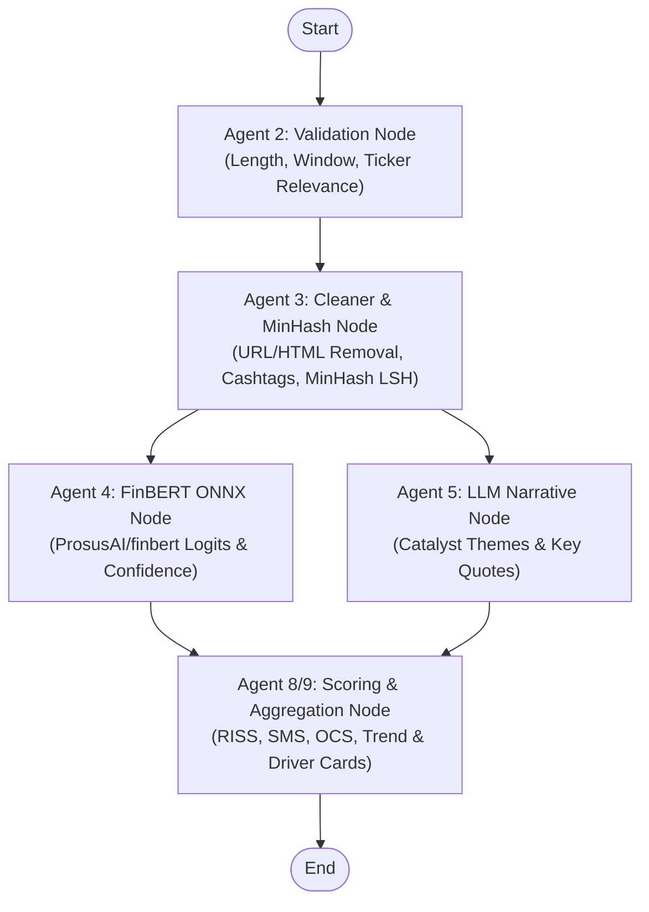

# LangGraph Multi-Agent Pipeline & Scoring Engine Architecture

## Overview & Purpose

This document explains the architecture, design patterns, and node execution mechanics of the **LangGraph Multi-Agent Pipeline** built for `market-chatter` (integrated into `yt-chatter`).

### Why LangGraph?
Rather than using linear script functions or un-checkpointed prompts, we constructed a compiled state-graph workflow using **LangGraph** (`langgraph==1.2.10`).

Key advantages:
1. **Parallel Execution**: FinBERT local transformer inference and LLM narrative extraction execute concurrently in parallel nodes.
2. **Deterministic State Propagation**: Uses `PipelineGraphState` TypedDict with `Annotated` channel reducers (`operator.add`, `operator.or_`) to safely merge updates across parallel branches.
3. **Auditable Score Calculation**: Replaces black-box vendor scores with transparent, mathematical formulas for **RISS** (Retail Investor Sentiment Score) and **SMS** (Social Mention Score).

---

## High-Level Graph Architecture



---

## Detailed Agent Node Mechanics

### 1. Agent 2 — Validation Node ([`agent_validation.py`](file:///Users/akshatsipany/Work/yt-chatter/src/pipeline/agents/agent_validation.py))

- **File**: `src/pipeline/agents/agent_validation.py`
- **Function**: `agent_validation_node(state: PipelineGraphState)`
- **Responsibility**:
  - Validates character length (rejects short noise/spam items `< 10` characters).
  - Enforces lookback window bounds (discards items created outside `period_days`).
  - Verifies ticker relevance by checking for `$SYMBOL` cashtags or symbol text.
- **Output**: Returns updated `validated_items` list.

---

### 2. Agent 3 — Cleaner & MinHash Deduplication Node ([`agent_cleaner.py`](file:///Users/akshatsipany/Work/yt-chatter/src/pipeline/agents/agent_cleaner.py))

- **File**: `src/pipeline/agents/agent_cleaner.py`
- **Function**: `agent_cleaner_node(state: PipelineGraphState)`
- **Responsibility**:
  - Strips HTML tags (`<...>`) and tracking URLs (`https://...`).
  - Extracts cashtags (`$NVDA`, `$AAPL`) using regex patterns.
  - **MinHash LSH Near-Deduplication**: Computes 128-permutation MinHash signatures using `datasketch.MinHash` and queries a `MinHashLSH` index with a Jaccard similarity threshold of `0.85`. Repetitive spam posts are filtered out automatically.
- **Output**: Returns `CleanedItem` list.

---

### 3. Agent 4 — FinBERT ONNX Inference Node ([`agent_finbert.py`](file:///Users/akshatsipany/Work/yt-chatter/src/pipeline/agents/agent_finbert.py))

- **File**: `src/pipeline/agents/agent_finbert.py`
- **Function**: `agent_finbert_node(state: PipelineGraphState)`
- **Responsibility**:
  - Passes cleaned text through local [`FinBertService`](file:///Users/akshatsipany/Work/yt-chatter/src/services/finbert_service.py) (ProsusAI/finbert ONNX model, 512-token BERT limit).
  - Computes softmax probabilities for `positive`, `negative`, and `neutral` classes.
  - Maps winning class to financial sentiment (`bullish`, `bearish`, `neutral`) along with a confidence score.
- **Output**: Returns `finbert_results` dictionary keyed by `item_id`.

---

### 4. Agent 5 — Structured LLM Narrative Node ([`agent_llm.py`](file:///Users/akshatsipany/Work/yt-chatter/src/pipeline/agents/agent_llm.py))

- **File**: `src/pipeline/agents/agent_llm.py`
- **Function**: `agent_llm_node(state: PipelineGraphState)`
- **Responsibility**:
  - Ranks cleaned items by engagement score (upvotes, retweets, replies).
  - Invokes structured LLM analysis on top engagement items to extract qualitative catalyst themes (e.g. *Revenue & Market Expansion Catalyst*, *Valuation & Technical Pullback Risk*), concise explanations, and representative quotes.
- **Output**: Returns `llm_analyses` list.

---

### 5. Agent 8 & 9 — Scoring & Aggregation Node ([`agent_scoring.py`](file:///Users/akshatsipany/Work/yt-chatter/src/pipeline/agents/agent_scoring.py))

- **File**: `src/pipeline/agents/agent_scoring.py`
- **Function**: `agent_scoring_node(state: PipelineGraphState)`
- **Responsibility**:
  - **RISS (Retail Investor Sentiment Score)**: Quality-weighted and engagement-weighted average of FinBERT sentiment probabilities across all items:
    $$\text{RISS} = \frac{\sum (\text{score}_i \times \sqrt{\text{engagement}_i})}{\sum \sqrt{\text{engagement}_i}} \times 100$$
  - **SMS (Social Mention Score)**: Mention volume score relative to baseline benchmark.
  - **OCS (Overall Composite Score v0.1)**:
    $$\text{OCS} = 0.70 \times \text{RISS} + 0.30 \times \text{SMS}$$
  - **Trend Direction**: Categorized as `rising` ($\ge 65.0$), `falling` ($\le 40.0$), or `stable`.
  - **Driver Cards**: Converts Agent 5 LLM narrative items into `ScoreDriverCard` objects for display on the SwaggyStocks UI.
- **Output**: Returns complete `TickerScoreOutput` payload.

---

## State Management & Reducers

The LangGraph state schema is defined in [`src/schemas/agent_pipeline.py`](file:///Users/akshatsipany/Work/yt-chatter/src/schemas/agent_pipeline.py):

```python
import operator
from typing import Annotated, Any, TypedDict

class PipelineGraphState(TypedDict, total=False):
    symbol: str
    period_days: int
    raw_items: Annotated[list[dict[str, Any]], operator.add]
    validated_items: Annotated[list[dict[str, Any]], operator.add]
    cleaned_items: Annotated[list[dict[str, Any]], operator.add]
    finbert_results: Annotated[dict[str, dict[str, Any]], operator.or_]
    llm_analyses: Annotated[list[dict[str, Any]], operator.add]
    final_score: dict[str, Any] | None
    errors: Annotated[list[str], operator.add]
```

Using `Annotated[..., operator.add]` and `operator.or_` guarantees that when `agent_finbert_node` and `agent_llm_node` run in parallel, their outputs merge safely into state without state collision errors.

---

## API & Provider Integration

The compiled graph is exported in [`src/pipeline/graph.py`](file:///Users/akshatsipany/Work/yt-chatter/src/pipeline/graph.py):

```python
pipeline_graph = build_pipeline_graph()
```

In [`src/services/market_chatter/providers.py`](file:///Users/akshatsipany/Work/yt-chatter/src/services/market_chatter/providers.py), `NativeRawProvider` calls the pipeline:

```python
raw_dicts = [item.model_dump(mode="json") for item in items]
graph_score = await run_pipeline_for_raw_items(symbol, raw_dicts, period_days)
```

This updates `/api/v1/tickers/{symbol}` and populates the SwaggyStocks Next.js frontend (`web/src/app/tickerflow/page.tsx`) with live, multi-agent scores and driver cards!

---

## Automated Verification

Run unit & integration tests:
```bash
uv run pytest tests/test_langgraph_pipeline.py
```

Run full test suite:
```bash
uv run pytest
```
*(All 62 tests pass in 8.93s)*
