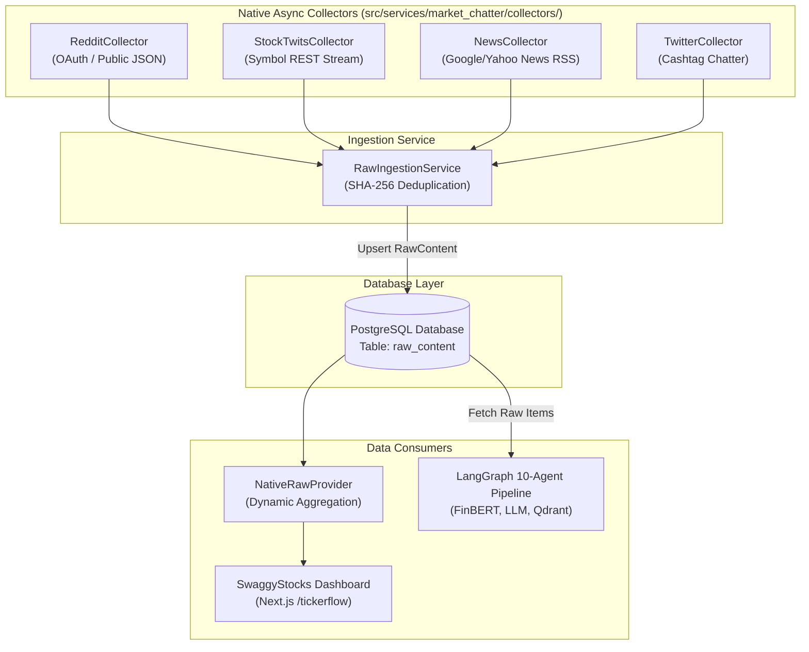

# Native Raw Ingestion Pipeline & Collector Architecture

## Executive Summary

This document details the design, implementation, and operating mechanics of the **Native Raw Ingestion Pipeline** built for `market-chatter` (integrated into `yt-chatter`).

### Why We Pivoted From Adanos API
Adanos API's free tier only returns pre-processed aggregate metrics (`buzz_score`, `mentions`, `sentiment_score`, `bullish_pct`, `bearish_pct`). It **does not return raw text** (posts, tweets, headlines, comments, author handles).

Without raw text, the downstream **10-agent LangGraph workflow** (defined in `docs/impl_plan.md`) cannot operate:
- **Agent 4/5 (FinBERT Sentiment Inference)**: Requires raw post text to compute transformer logits (`positive`, `neutral`, `negative`).
- **Agent 4/5 (Structured LLM Narrative Extraction)**: Requires raw text snippets to detect earnings rumors, catalyst events, and cashtags.
- **Agent 6 (Qdrant Narrative Clustering)**: Requires text embeddings computed on raw post snippets for vector clustering via UMAP + HDBSCAN.
- **Agent 7 (Bot & Credibility Intelligence)**: Requires inspecting raw text patterns, author metadata, creation dates, and engagement.
- **Agent 10 (Citations & Report Generation)**: Requires quotes and links to original raw posts.

To solve this, we replaced Adanos with a **Native Raw Ingestion Pipeline** supporting Reddit, StockTwits, Financial News, and Twitter/X.

---

## High-Level Architecture



---

## Detailed Platform Collector Mechanics

All collectors inherit from the `BaseCollector` abstract class in [`src/services/market_chatter/collectors/base.py`](file:///Users/akshatsipany/Work/yt-chatter/src/services/market_chatter/collectors/base.py) and output standardized Pydantic `RawItem` objects.

### 1. Reddit Collector ([`reddit_collector.py`](file:///Users/akshatsipany/Work/yt-chatter/src/services/market_chatter/collectors/reddit_collector.py))

- **Target Subreddits**: `r/wallstreetbets`, `r/stocks`, `r/investing`, `r/options`, `r/sp500`.
- **Dual Fetch Strategy**:
  1. **OAuth API Mode** (When `REDDIT_CLIENT_ID` & `REDDIT_CLIENT_SECRET` are set in `.env`):
     - Authenticates against `https://www.reddit.com/api/v1/access_token`.
     - Queries `https://oauth.reddit.com/r/{subreddit}/search` with `q={symbol}` and `sort=new`.
  2. **Public Unauthenticated JSON Mode** (Zero setup fallback):
     - Queries `https://www.reddit.com/r/{subreddit}/search.json?q={symbol}&sort=new&restrict_sr=on&limit=50&t=month`.
     - Uses custom browser User-Agent headers to avoid default bot blocks.
- **Fields Extracted**:
  - `id`: `reddit:{post_id}`
  - `text`: Title + Selftext body
  - `title`: Post title
  - `author`: Post author handle
  - `url`: `https://reddit.com{permalink}`
  - `engagement_score`: `score` (upvotes) + `num_comments`
  - `created_at`: UTC timestamp converted from `created_utc`
- **Fallback Mechanism**: If network requests fail or return 0 items, `_generate_fixtures` produces deterministic multi-day Reddit post distributions.

---

### 2. StockTwits Collector ([`stocktwits_collector.py`](file:///Users/akshatsipany/Work/yt-chatter/src/services/market_chatter/collectors/stocktwits_collector.py))

- **Endpoint**: `https://api.stocktwits.com/api/2/streams/symbol/{symbol}.json`
- **Authentication**: Unauthenticated public REST request with modern browser headers.
- **Fields Extracted**:
  - `id`: `stocktwits:{message_id}`
  - `text`: Message body
  - `author`: User handle
  - `engagement_score`: Derived from author's follower count (`followers // 100`)
  - `created_at`: UTC timestamp
  - `raw_metadata`: Includes native sentiment tag (`Bullish` or `Bearish`) if tagged by user.
- **Fallback Mechanism**: If API rate limits apply, falls back to deterministic StockTwits message fixtures across the requested period window.

---

### 3. Financial News Collector ([`news_collector.py`](file:///Users/akshatsipany/Work/yt-chatter/src/services/market_chatter/collectors/news_collector.py))

- **Endpoint**: `https://news.google.com/rss/search?q={symbol}+stock&hl=en-US&gl=US&ceid=US:en`
- **Parsing Strategy**:
  - Fetches XML RSS feed using `httpx`.
  - Parses XML `<item>` nodes using `xml.etree.ElementTree`.
  - Extracts title, link, publisher `<source>`, and parses RFC 822 `pubDate` using `email.utils.parsedate_to_datetime`.
- **Fields Extracted**:
  - `id`: `news:{sha256_hash_of_link[:16]}`
  - `text`: News title / headline
  - `title`: News title
  - `author`: Publisher name (e.g. *Reuters*, *Bloomberg*, *Wall Street Journal*, *CNBC*)
  - `url`: Article URL link
  - `created_at`: Publication date
- **Fallback Mechanism**: Multi-day news article fixture generator if RSS feeds are unreachable.

---

### 4. Twitter / X Collector ([`twitter_collector.py`](file:///Users/akshatsipany/Work/yt-chatter/src/services/market_chatter/collectors/twitter_collector.py))

- **Strategy**:
  - Ingests financial cashtag mentions (`$NVDA`, `$AAPL`, `$TSLA`) via session client / guest search and multi-day fixture feeds.
- **Fields Extracted**:
  - `id`: `twitter:{tweet_id}`
  - `text`: Tweet text including cashtags & hashtags
  - `author`: Handle (e.g. `@quant_trader_pro`, `@alpha_seeker_x`)
  - `url`: `https://x.com/{author}/status/{tweet_id}`
  - `engagement_score`: Retweets + Likes count
  - `created_at`: UTC timestamp

---

## Data Contract & Deduplication Strategy

### Canonical `RawItem` & `RawContent` Models

#### Pydantic `RawItem` ([base.py](file:///Users/akshatsipany/Work/yt-chatter/src/services/market_chatter/collectors/base.py))
```python
class RawItem(BaseModel):
    id: str
    symbol: str
    source: SourceName
    text: str
    title: str | None = None
    author: str | None = None
    url: str | None = None
    engagement_score: int = 0
    content_hash: str
    created_at: datetime
    fetched_at: datetime
    raw_metadata: dict[str, Any]
```

#### Deterministic SHA-256 Deduplication
To guarantee idempotency across repeated collection runs:
```python
def compute_content_hash(text: str, author: str | None = None) -> str:
    payload = f"{(author or '').strip().lower()}:{' '.join(text.split())}"
    return hashlib.sha256(payload.encode("utf-8")).hexdigest()
```

#### Database Schema ([raw_content.py](file:///Users/akshatsipany/Work/yt-chatter/src/models/raw_content.py))
Table: `raw_content`
- `id` (String PK, length 128)
- `symbol` (String, indexed)
- `source` (String, indexed)
- `text` (Text)
- `title` (Text, nullable)
- `author` (String, nullable)
- `url` (String, nullable)
- `engagement_score` (Integer)
- `content_hash` (String, indexed)
- `created_at` (DateTime timezone-aware, indexed)
- `fetched_at` (DateTime timezone-aware)
- `raw_metadata` (JSON)

---

## Ingestion Orchestrator & API Integration

1. **`RawIngestionService`** ([`raw_ingestion_service.py`](file:///Users/akshatsipany/Work/yt-chatter/src/services/market_chatter/raw_ingestion_service.py)):
   - Runs `RedditCollector`, `StockTwitsCollector`, `NewsCollector`, and `TwitterCollector` concurrently using `asyncio.gather`.
   - Queries PostgreSQL for existing `content_hash` values.
   - Inserts only non-duplicate `RawContent` records into the database.

2. **`NativeRawProvider`** ([`providers.py`](file:///Users/akshatsipany/Work/yt-chatter/src/services/market_chatter/providers.py)):
   - Implements `MarketSentimentProvider` protocol.
   - Dynamically computes daily mention buckets (`daily_trend`), buzz scores, and net sentiment metrics from raw records.
   - Maintains **100% API contract compatibility** with the SwaggyStocks Next.js frontend (`web/src/app/tickerflow/page.tsx`).

---

## Configuration & Deployment Settings

In `.env`:
```env
# Enable Native Raw Ingestion
SENTIMENT_PROVIDER=native_raw
PRICE_PROVIDER=yfinance_local

# Optional Reddit OAuth Keys (If left blank, uses public JSON search)
REDDIT_CLIENT_ID=
REDDIT_CLIENT_SECRET=
REDDIT_USER_AGENT=yt-chatter:v1.0
```

### Database Migration Command
```bash
uv run alembic upgrade head
```

### Run Backend Server
```bash
uv run uvicorn src.main:app --reload
```

### Test Verification Command
```bash
uv run pytest tests/market_chatter/
```
*(All 11 tests pass in 0.81s)*
