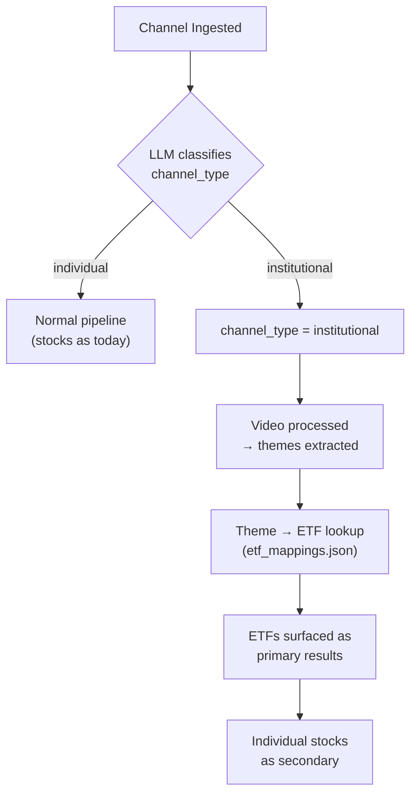

# ETF Mapping for Institutional Channels

## Problem

The product works well for **Category 1** channels (individual creators like ProfGMarkets) who comment on specific stocks. It doesn't work well for **Category 2** channels (institutional - Fundstrat, Morgan Stanley, GS) who comment on sectors/industries without naming individual stocks.

## Solution

When a channel is classified as "institutional," we surface **ETFs as the primary recommendations** instead of (or alongside) individual stocks. ETF mappings are **hardcoded in a static JSON file** for determinism, auditability, and zero LLM cost.

> [!IMPORTANT]
> **Why hardcoded over LLM-generated ETFs?** The sector→ETF mapping is a finite, stable, well-known universe (~40-60 entries). LLMs introduce non-determinism (same input → different ETFs across calls), hallucination risk (suggesting delisted/nonexistent ETFs), and unnecessary latency/cost. A curated JSON gives you 100% consistency and auditability - critical for a financial product tracking predictions.

---

## Proposed Changes

### 1. Channel Type Classification (Auto via LLM at Ingestion)

#### [MODIFY] [channel.py](file:///Users/akshatsipany/Work/yt-chatter/src/models/channel.py)
- Add `channel_type: Mapped[str]` column with default `"individual"`. Values: `"individual"` | `"institutional"`.
- This is a one-time classification, set when the channel is first ingested.

#### [MODIFY] [ingestion.py](file:///Users/akshatsipany/Work/yt-chatter/src/pipeline/ingestion.py)
- After fetching channel metadata (`title`, `description`), make a lightweight LLM call (GPT-5.4-nano, ~10 tokens output) to classify the channel as `individual` or `institutional`.
- Classification prompt criteria:
  - **Institutional**: Financial institutions, banks, brokerages, research firms, hedge funds, asset managers. Examples: Fundstrat, Morgan Stanley, Goldman Sachs, JP Morgan, BlackRock, Bloomberg, CNBC.
  - **Individual**: Personal channels run by individual traders/analysts/influencers. Examples: ProfGMarkets, Meet Kevin, Stock Moe.
- Set `channel.channel_type` based on LLM response.
- This only runs **once per channel at ingestion time**, so cost is negligible.

#### [NEW] Alembic migration
- Add `channel_type VARCHAR(50) DEFAULT 'individual'` column to `channels` table.

#### [MODIFY] [schemas/__init__.py](file:///Users/akshatsipany/Work/yt-chatter/src/schemas/__init__.py)
- Add `channel_type: str = "individual"` to `ChannelResponse`.

---

### 2. ETF Mapping Data

#### [NEW] [etf_mappings.json](file:///Users/akshatsipany/Work/yt-chatter/data/etf_mappings.json)
- Separate JSON file in `data/` (as you chose).
- Structure: mappings at both **sector** and **industry** levels, each with a list of ETFs.

```json
{
  "sector_etfs": {
    "Technology": ["XLK", "QQQ", "VGT"],
    "Financials": ["XLF", "VFH", "KBE"],
    "Healthcare": ["XLV", "VHT", "IBB"],
    "Consumer": ["XLY", "XLP", "VCR"],
    "Industrials": ["XLI", "VIS"],
    "Energy": ["XLE", "VDE"],
    "Geopolitics / Macro": ["SPY", "GLD", "TLT"]
  },
  "industry_etfs": {
    "Semiconductors": ["SMH", "SOXX"],
    "Big Tech / FAANG": ["QQQ", "XLK"],
    "Software & AI": ["IGV", "WCLD", "BOTZ"],
    "Banking & Interest Rates": ["KBE", "KRE", "XLF"],
    "Insurance & Fintech": ["KIE", "ARKF"],
    "Retail & Spending": ["XRT", "RTH"],
    "Travel & Hospitality": ["JETS", "PEJ"],
    "Pharma & Biotech": ["IBB", "XBI", "BBH"],
    "MedTech & Healthcare AI": ["IHI", "ARKG"],
    "Defense & Security": ["ITA", "PPA", "XAR"],
    "Energy & Resources": ["XLE", "XOP", "OIH"],
    "Infrastructure & Aerospace": ["PAVE", "IFRA"],
    "Clean Energy & EVs": ["ICLN", "TAN", "QCLN", "LIT", "DRIV"],
    "Macro Risks": ["GLD", "TLT", "TIPS", "SHY"]
  },
  "theme_etfs": {
    "AI Chips": ["SMH", "SOXX"],
    "Cloud Computing": ["SKYY", "WCLD"],
    "Cybersecurity": ["HACK", "CIBR", "BUG"],
    "EVs": ["LIT", "DRIV", "IDRV"],
    "Clean Energy": ["ICLN", "TAN", "QCLN"],
    "Rate Cuts": ["TLT", "XLF", "KRE"],
    "Biotech": ["XBI", "IBB"],
    "Defense": ["ITA", "XAR"],
    "Inflation": ["TIPS", "GLD", "DBC"],
    "Recession Fears": ["XLU", "XLP", "GLD", "TLT"]
  }
}
```

> [!NOTE]
> The above is a comprehensive starting point. You can add/edit entries at any time - it's just a JSON file. The ETFs chosen are the most liquid, most widely held ETFs for each category (SPDR, iShares, Vanguard, First Trust sector ETFs plus popular thematic ETFs).

#### [NEW] [etf_mapping_service.py](file:///Users/akshatsipany/Work/yt-chatter/src/services/etf_mapping_service.py)
- Loads `etf_mappings.json` once at startup.
- Provides `resolve_etfs(sector: str, industry: str | None, theme: str | None) -> list[str]` - returns the most specific ETFs available (theme > industry > sector fallback).
- Pure Python, zero LLM calls, deterministic.

---

### 3. Integration Into Search & Aggregation

#### [MODIFY] [search_service.py](file:///Users/akshatsipany/Work/yt-chatter/src/services/search_service.py)
- In `search_stocks_for_query()`: after building `ticker_data`, if the request is scoped to an institutional channel (or the sector_discovery is from an institutional context), inject matching ETFs from `ETFMappingService` at the top of results with high composite scores.
- ETFs are surfaced as first-class `StockDiscoveryResult` entries - the frontend already renders them (ETF tickers work with yfinance for price charts too).

#### [MODIFY] [aggregation_service.py](file:///Users/akshatsipany/Work/yt-chatter/src/services/aggregation_service.py)
- In `get_channel_top_stocks()`: if the channel is institutional, supplement/replace top stock results with ETFs resolved from the channel's most-discussed themes.

#### [MODIFY] [search.py](file:///Users/akshatsipany/Work/yt-chatter/src/api/search.py) (API endpoint)
- Pass `channel_type` context through to search service when a channel filter is applied.
- For global sector_discovery queries (no channel filter), optionally include ETFs alongside stocks.

---

### 4. Schema Updates

#### [MODIFY] [schemas/__init__.py](file:///Users/akshatsipany/Work/yt-chatter/src/schemas/__init__.py)
- Add `is_etf: bool = False` to `StockDiscoveryResult` - allows the frontend to badge/differentiate ETFs from individual stocks.

---

## Data Flow



---

## Open Questions

> [!IMPORTANT]
> **ETF on ticker detail page**: When a user clicks on an ETF (e.g., SMH) from search results, should the `/tickers/[ticker]` page work identically (price chart, sentiment timeline, etc.)? It should - yfinance supports ETFs - but the "predictions" section will be empty since nobody explicitly predicted "SMH". Should we show the underlying sector predictions instead? (e.g., all semiconductor predictions mapped to SMH).

> [!IMPORTANT]
> **Existing channels**: Should I write a one-time migration script to classify your already-ingested channels, or just classify them going forward?

---

## Verification Plan

### Automated Tests
- Unit test for `ETFMappingService.resolve_etfs()` - verify correct fallback chain (theme → industry → sector).
- Unit test for channel classification prompt - mock LLM response, verify `channel_type` is set.
- Integration test: ingest a mock "institutional" channel → process a video about "semiconductors" → verify SMH/SOXX appear in top stocks.

### Manual Verification
- Run the dev stack, add a known institutional channel (e.g., a Fundstrat-like test channel).
- Verify that the channel detail page shows ETFs as top recommendations.
- Verify that searching "semiconductors" in the search bar surfaces SMH/SOXX prominently when scoped to the institutional channel.
- Verify the ticker detail page works for ETF tickers (price chart renders, sentiment timeline works).
